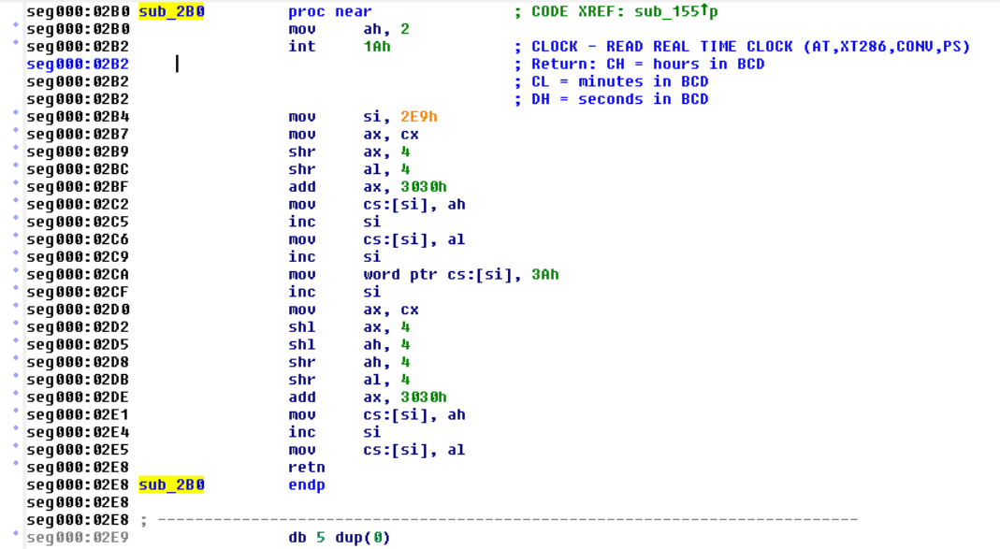
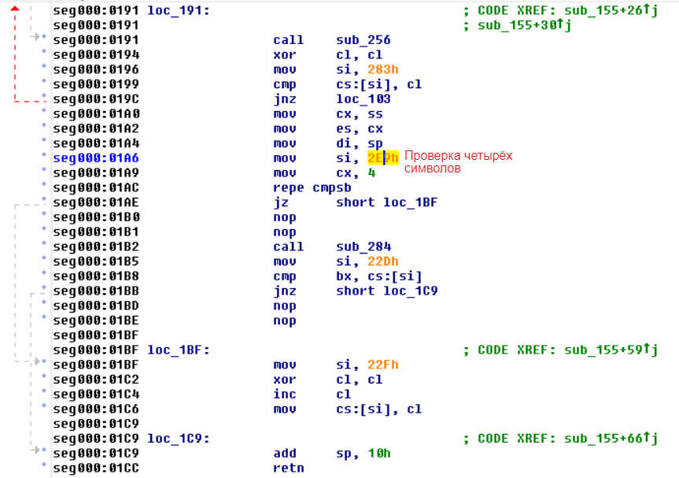
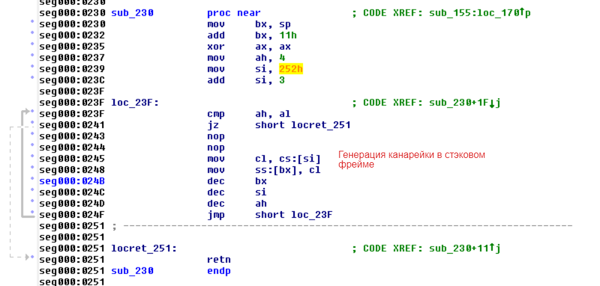
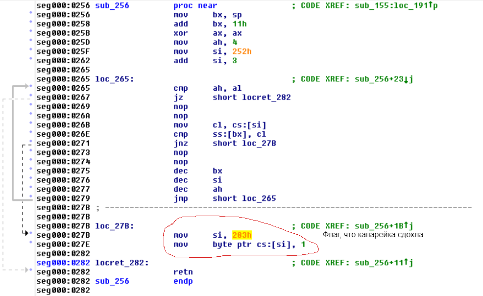
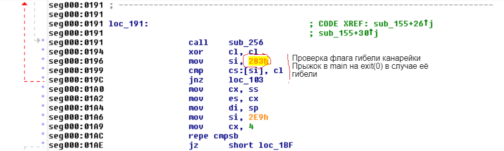
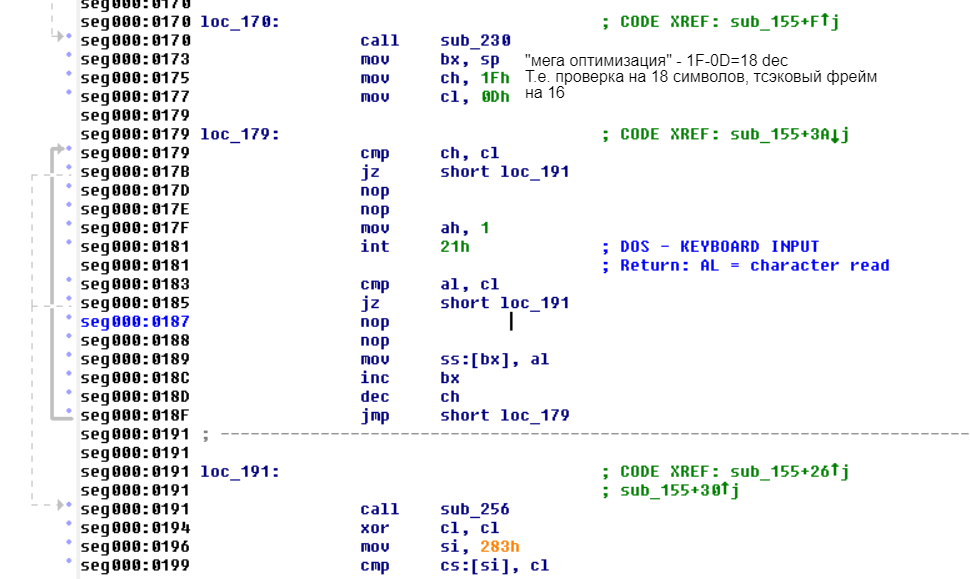
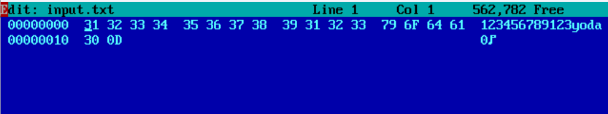
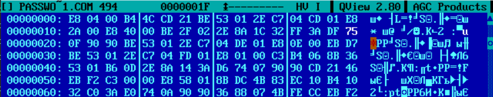
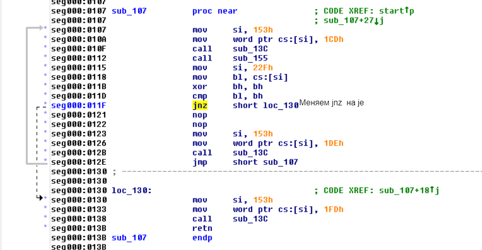

# Взлом программы на DOS

## Описание задания

В данном задании надо было взломать напарника (@coffee8cat) найдя заранее заложенные уязвимости в коде.

---

## Лёгкая уязвимость

### Описание проблемы
1. Программа использует текущее системное время для генерации пароля.
   
2. При проверке пароля учитываются только первые четыре символа, хотя сама строка пароля должна быть длиннее. Например, "19:20" - 5 уже символов, но проверка делается только на первые 4.
   

### Как взломать?
- Посмотреть системное время запуска программы.
- Ввести только первые четыре символа пароля, поскольку остальная часть не проверяется, либо после четвёртого символа ввести что угодно (до 16 символов в сумме).

---

## Сложная уязвимость

### Описание проблемы
1. Программа защищена с помощью механизма "канареек" (canary protection).
   
2. Однако если канарейка повреждена, программа немедленно завершает работу.
   
   
3. Проверка длины пароля с уязвимостью она разрешает ввод, превышающий размер буфера в стеке на два байта.
   
4. Это позволяет изменить адрес возврата и передать управление нужной нам функции.

### Как взломать?
- Ввести правильное значение канарейки на 12-16 байты (канарейка "yoda") перед попыткой использования.
- Использовать переполнение буфера: на 17ый байт записать адрес возврата сразу после проверки правильности пароля.

---

## Патчер

Программа также включает проверку целостности файла по хэшу:
1. Определяет, является ли файл оригинальным или взломанным.
2. Позволяет пропатчить программу, заменяя байт `0x1F` на `0xEB`.

---

